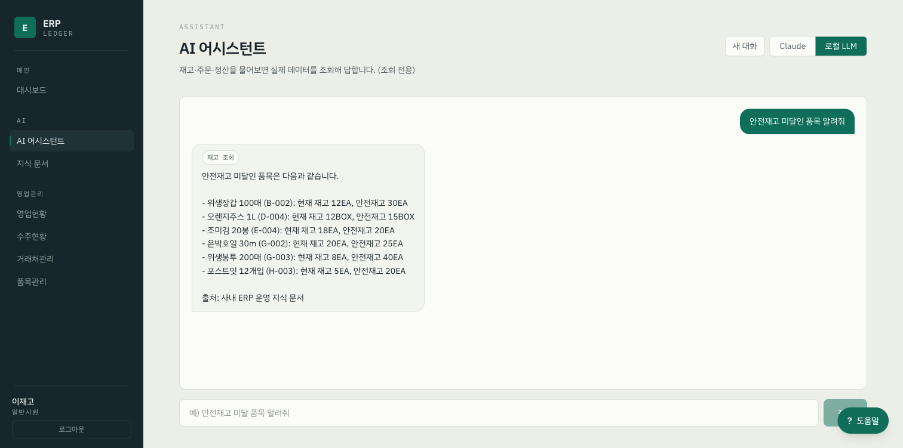
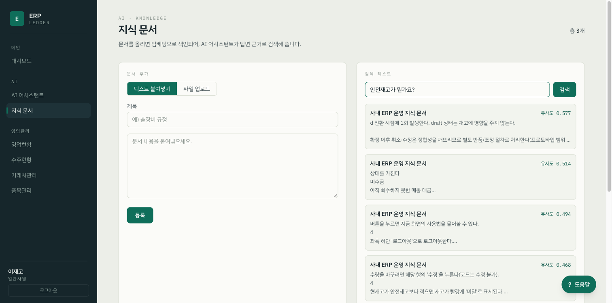
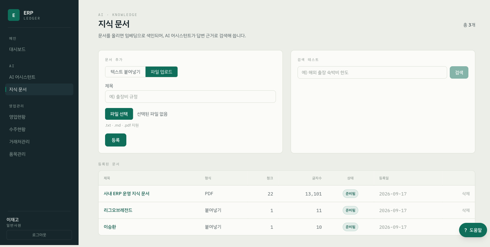
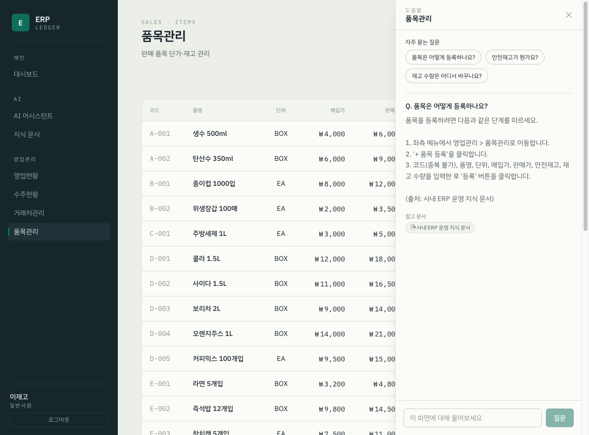
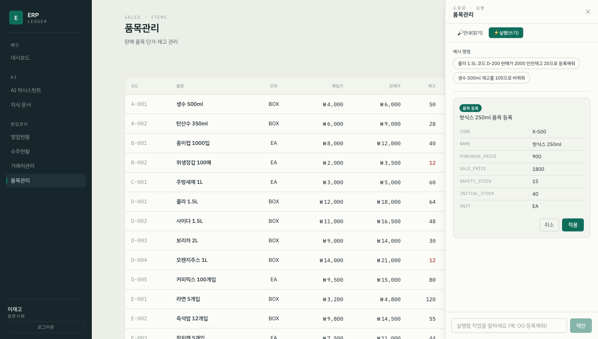

# 제조 ERP 프로토타입

Next.js · FastAPI · PostgreSQL 기반의 제조/유통 ERP 프로토타입입니다.
구매 → 재고 → 판매 → 정산으로 이어지는 핵심 업무 흐름과, **실제 ERP 데이터를 조회하는 AI 업무 보조 챗봇**을 내장했습니다. 전체를 Docker Compose로 묶어 한 번에 실행합니다.

## 주요 기능

- **재고/기준정보** — 품목·단가·안전재고 관리, 초기 재고 등록
- **주문** — 구매(발주)·판매(수주) 생성, **주문 확정 시 재고 자동 반영 + 전표 생성**
- **거래처** — 공급처/고객 관리
- **회계** — 매입/매출 전표, 미수금·미지급금, 계정·경비
- **인사** — 직원·근태
- **대시보드** — 매출·매입·재고·정산 요약 지표
- **AI 챗봇** — 재고·주문·거래처·정산을 자연어로 질의. LLM이 도구(tool)로 실제 DB를 조회해 답변 (Claude / 로컬 Ollama 선택 가능)

## 🖼️ AI 기능 데모

> 아래 스크린샷은 GitHub에서 바로 렌더됩니다. (한 페이지 갤러리: [실행 데모 갤러리](https://claude.ai/code/artifact/9c628d5a-4f79-4281-83a5-d3cde5f2ea5f))

실제 실행 화면입니다. (로컬 Ollama `qwen2.5:7b` 기준)

### 1. AI 어시스턴트 — 도구(tool)로 실데이터 조회
자연어 질문을 받으면 LLM이 `get_inventory` 등 도구를 호출해 **실제 DB 값**으로 답합니다.



### 2. RAG 지식 문서 어드민 — 업로드·색인·검색 품질 테스트
문서를 올리면 임베딩(`bge-m3`)으로 색인되고, **검색 테스트**로 질의별 유사도 점수를 바로 확인할 수 있습니다.



**PDF/MD/텍스트 업로드 → 자동 색인** — 파일을 올리면 청킹·임베딩되어 목록에 상태(색인 중 → 준비됨)와 청크 수가 표시됩니다. (아래: PDF 문서가 22청크로 색인되어 등록된 모습)



### 3. 화면 컨텍스트 도우미 — RAG 근거 + 출처
현재 화면을 인식해 "이 화면에서 이렇게 하면 됩니다"를 **지식 문서 근거와 출처**로 답합니다.



### 4. 실행(액션) 에이전트 — 제안 → 확인 → 적용
"OO 등록해줘" → LLM이 **구조화 제안**을 만들고, 사용자가 확인(적용)해야 실제로 반영됩니다(human-in-the-loop).



## 아키텍처

```
web (Next.js :3000)  ──REST·SSE──▶  api (FastAPI :8000)  ──psycopg2──▶  db (PostgreSQL :5432)
```

| 서비스 | 역할 | 기술 |
|--------|------|------|
| `web` | 화면·UX | Next.js 14 (App Router), React 18, TypeScript, Tailwind CSS |
| `api` | 비즈니스 로직·API·AI 챗봇 | FastAPI, SQLModel, anthropic SDK, httpx |
| `db`  | 데이터 저장 | PostgreSQL 16 (`pgdata` 볼륨에 영속) |

> `docker-compose.yml`에서 `environment`가 `env_file`보다 우선하므로, 컨테이너의 `DATABASE_URL`은 항상 `db:5432`(컨테이너 내부 주소)로 고정됩니다.

## 기술 스택

| 영역 | 스택 |
|------|------|
| 백엔드 | Python 3.12 · FastAPI 0.115 · Uvicorn · SQLModel 0.0.22 · Alembic 1.14 · psycopg2 |
| 프론트엔드 | TypeScript 5.6 · Next.js 14.2 · React 18.3 · Tailwind CSS 3.4 |
| AI | anthropic SDK 0.39 · httpx · Ollama(로컬 LLM) |
| 인프라 | PostgreSQL 16 · Docker Compose |

## 빠른 시작

```bash
# 1. 환경변수 준비
cp .env.example .env

# 2. 전체 기동 (최초엔 이미지 빌드로 수 분 소요)
docker compose up --build
```

- 프론트엔드: <http://localhost:3000>
- API 문서(Swagger): <http://localhost:8000/docs>
- 헬스체크: <http://localhost:8000/health>

최초 기동 시 `SEED_ON_START=true`면 샘플 품목·거래처·직원 데이터가 자동 삽입됩니다.
DB 데이터를 완전히 초기화하려면 `docker compose down -v`로 볼륨까지 삭제하세요.

## 환경 변수 (`.env`)

| 변수 | 설명 | 기본값 |
|------|------|--------|
| `POSTGRES_USER` / `POSTGRES_PASSWORD` / `POSTGRES_DB` | DB 접속 정보 | `erp` |
| `SEED_ON_START` | 기동 시 샘플 데이터 삽입 여부 | `true` |
| `NEXT_PUBLIC_API_URL` | 브라우저에서 호출할 API 주소(호스트 기준) | `http://localhost:8000` |
| `ANTHROPIC_API_KEY` | Claude API 키 (사용량 과금) | *(비어 있음)* |
| `CLAUDE_MODEL` | Claude 모델명 | `claude-sonnet-5` |
| `OLLAMA_BASE_URL` / `OLLAMA_MODEL` | 로컬 LLM 서버·모델 태그 | `http://localhost:11434` / `qwen2.5:7b` |

## AI 챗봇 설정

챗봇은 `POST /chat`의 `model` 값에 따라 두 경로로 라우팅됩니다.

| 경로 | 조건 | 비고 |
|------|------|------|
| **① Claude API** | `model: "claude"` | `ANTHROPIC_API_KEY`로 정식 tool-use (사용량 과금) |
| **② 로컬** | `model: "local"` | Ollama(`qwen2.5:7b`) — httpx로 `/api/chat` 호출 |

- **로컬 실행:** 호스트에서 `ollama serve` + `ollama pull qwen2.5:7b`. 컨테이너에서 호스트 Ollama를 쓰려면 `OLLAMA_BASE_URL=http://host.docker.internal:11434`로 지정.
- **도구(Phase A, 조회 전용):** `get_dashboard`, `get_inventory`, `list_orders`, `list_partners`. 하나의 도구 정의를 Claude·Ollama 규격으로 각각 변환해 재사용합니다. LLM은 응답을 SSE로 스트리밍하며, 최대 6회까지 도구 호출을 반복합니다.

## 주요 API

| 메서드 | 경로 | 설명 |
|--------|------|------|
| GET  | `/dashboard` | 매출·매입·재고·정산 요약 |
| GET/POST | `/items` | 품목 목록 / 등록(초기재고 포함) |
| GET/POST | `/partners` | 거래처 목록 / 등록 |
| GET/POST | `/orders` | 주문 목록 / 생성(구매·판매) |
| POST | `/orders/{id}/confirm` | **주문 확정 → 재고 자동 반영 + 전표 생성** |
| GET | `/employees` · `/accounts` · `/expenses` | 인사·회계 조회 |
| POST | `/chat` | AI 챗봇 (SSE 스트리밍) |

전체 스펙은 Swagger UI(`/docs`)에서 확인할 수 있습니다.

## 데이터 모델

주문(`Order`)을 중심으로 물류와 회계가 엮이고, 인사 도메인은 독립적으로 분리돼 있습니다.

- **`Order` → `OrderLine` (1:N)** — 주문 삭제 시 라인 자동 삭제(`cascade delete-orphan`)
- **`Item` → `Stock` (1:1)** — `item_id` unique로 품목당 재고 레코드 하나 강제
- **`Voucher`** — `Order`·`Partner` 양쪽을 FK로 참조해 회계(매입/매출)와 물류를 연결
- **`Employee` → `Attendance` (1:N)** — FK로 다른 도메인과 연결되지 않는 독립 도메인
- 모든 금액은 `int`(원 단위)로 저장 — 부동소수점 오차로 회계 합계가 틀어지는 것을 방지

## 프로젝트 구조

```
seunghwan-erp/
├── docker-compose.yml          # db · api · web 3-컨테이너 정의
├── .env.example                # 환경 변수 템플릿
├── backend/
│   ├── Dockerfile
│   ├── requirements.txt
│   └── app/
│       ├── main.py             # FastAPI 앱 · lifespan(DB 대기·시드) · CORS
│       ├── database.py         # 엔진 · 테이블 생성
│       ├── models.py           # SQLModel 테이블 정의
│       ├── schemas.py          # 요청/응답 스키마
│       ├── seed.py             # 샘플 데이터
│       ├── routers/            # dashboard · items · partners · orders · employees · accounts · expenses
│       └── chat/               # AI 챗봇: router(SSE) · providers(라우팅) · tools
└── frontend/
    ├── Dockerfile
    ├── package.json
    └── app/                    # App Router: 도메인별 page + components + lib/api.ts
```

## 프로토타입 범위

- **포함:** 핵심 업무 흐름(구매→재고→판매→정산), 화면·데이터 구조 검증, AI 챗봇(조회)
- **제외:** 인증/권한, 세금계산서 발행, 실 결제, 성능 최적화, AI 쓰기 도구(주문 생성 등)

자세한 기획은 [`erp-prototype-plan.html`](./erp-prototype-plan.html), AI 챗봇 설계는 [`docs/ai-chatbot-plan.md`](./docs/ai-chatbot-plan.md) 참고.

## 개발 메모

- 코드 변경은 볼륨 마운트 + hot reload로 즉시 반영됩니다(재빌드 불필요).
- 스키마는 프로토타입에선 `SQLModel.metadata.create_all`로 생성합니다. 운영 전환 시 Alembic 마이그레이션으로 전환하세요.
- CORS는 프로토타입 편의상 모든 오리진을 허용합니다. 운영 시 반드시 제한하세요.
# seunghwan-erp
