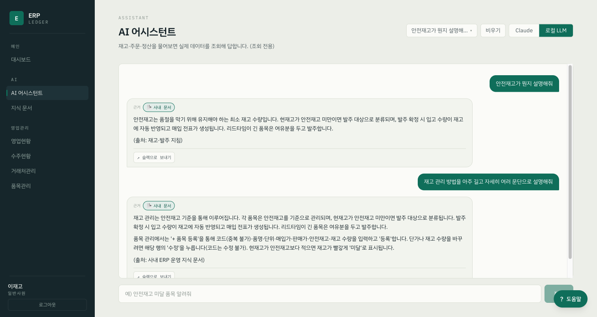
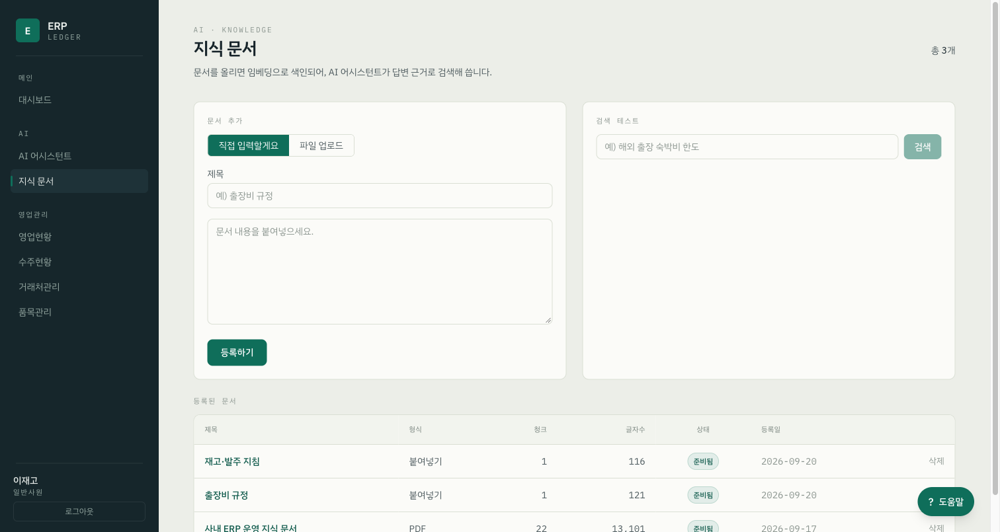
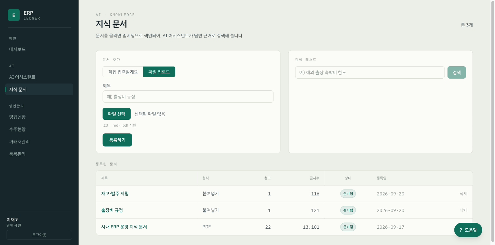
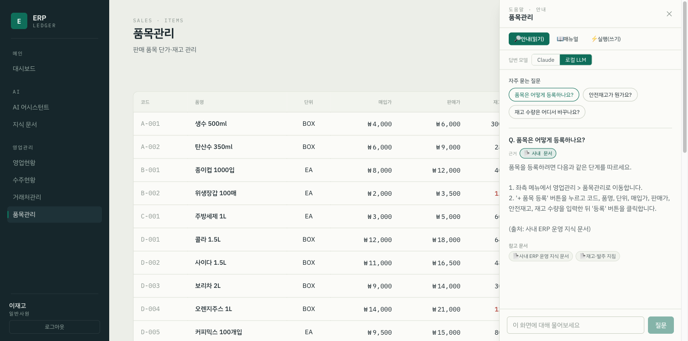
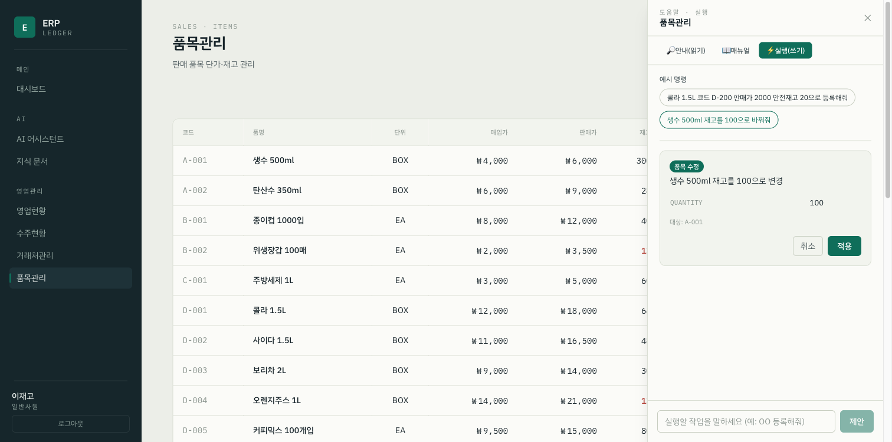

# 제조 ERP 프로토타입

Next.js · FastAPI · PostgreSQL 기반의 제조/유통 ERP 프로토타입입니다.
구매 → 재고 → 판매 → 정산으로 이어지는 핵심 업무 흐름과, **실시간 데이터·사내 문서·웹을 스스로 판단해 근거로 답하는 RAG 에이전트 ‘원장’**을 내장했습니다. 전체를 Docker Compose로 묶어 한 번에 실행합니다.

## 주요 기능

- **재고/기준정보** — 품목·단가·안전재고 관리, 초기 재고 등록
- **주문** — 구매(발주)·판매(수주) 생성, **주문 확정 시 재고 자동 반영 + 전표 생성**
- **거래처** — 공급처/고객 관리
- **회계** — 매입/매출 전표, 미수금·미지급금, 계정·경비
- **인사** — 직원·근태
- **대시보드** — 매출·매입·재고·정산 요약 지표
- **AI 에이전트 ‘원장(元帳)’** — 정체성 + 5단계 리즈닝(의도 분류 → 근거 계획 → 도구 실행 → 자기 점검 → 답변)을 갖춘 RAG 에이전트. **실시간 수치는 도구 / 사내 규정은 문서 / 외부 정보는 웹**으로 스스로 근거 경로를 판단 (Claude API · 로컬 Ollama 모델 라우팅)
- **실시간 스트리밍 채팅 UX** — 토큰 단위 스트리밍·생성 중 중지(AbortController)·점진적 Markdown 렌더·도구 실행 상태 표시·**멀티 대화(URL 딥링크 `?c=`)**·메시지 가상화·재시도/자동 재연결. 여기에 **자동높이 입력(Shift+Enter 줄바꿈)·답변 복사·다시 생성·‘↓ 최신으로’·토스트 알림** 등 편의 기능과 Playwright E2E 회귀 검증까지 (자세히는 [채팅 프론트엔드](#채팅-프론트엔드-스트리밍-ux) 참고)
- **RAG 지식 문서 관리** — 문서(PDF·MD·텍스트) 업로드 → 임베딩(`bge-m3`) 색인 → 검색. 챗봇이 사내 규정·매뉴얼을 **근거(출처)와 함께** 답변. 관리 페이지에서 업로드·색인 상태·검색 품질 테스트·삭제까지 제공
- **근거 라우팅 & 할루시네이션 제어** — 검색·도구 결과를 근거로 자동 주입하고, 근거가 없으면 코드 레벨에서 답변 차단(`RAG_STRICT`). 임베딩 유사도 분포를 측정해 자동주입 임계값을 **0.50**(잡음/신호 사이)으로 캘리브레이션
- **출처 배지(Provenance)** — 답변마다 근거 출처(🌐 웹 검색 / 📄 사내 문서 / 📊 ERP 데이터 / 🧠 근거 없음)를 표시해 오해를 제거
- **웹 검색(web_search)** — 사내 데이터로 답할 수 없는 외부 정보는 웹 검색으로 라우팅. 로컬 모델의 도구호출 실패는 서버측 폴백 검색으로 보완
- **화면 컨텍스트 도우미** — 현재 화면을 인식해 사용법을 RAG 근거로 안내하고, 자연어로 등록/수정까지 실행
- **실행(액션) 에이전트** — 자연어 명령 → 구조화 제안 → 사용자 확인 → 실행(plan/apply, human-in-the-loop)
- **외부 연동 & 감사 로그** — Slack/Discord 웹훅 알림(사용자 확인 후 전송) + 모든 도구 호출·전송을 감사 로그(`AuditLog`)에 기록
- **권한 관리(RBAC)** — 역할·모듈 권한 정의 + 로그인·메뉴/라우트 접근 제어

## 🖼️ AI 기능 데모

> 아래 스크린샷은 GitHub에서 바로 렌더됩니다. (한 페이지 갤러리: [실행 데모 갤러리](https://claude.ai/code/artifact/9c628d5a-4f79-4281-83a5-d3cde5f2ea5f))

실제 실행 화면입니다. (로컬 Ollama `qwen2.5:7b` 기준)

### 1. AI 어시스턴트 — 실시간 스트리밍 · 출처 배지 · 멀티 대화
자연어 질문을 **토큰 단위로 스트리밍**해 답하고, 답변마다 **근거 출처 배지**(🌐 웹 / 📄 사내 문서 / 📊 ERP 데이터)를 표시합니다. 답변엔 **복사·다시 생성·슬랙 보내기**, 입력창은 자동 높이(Shift+Enter 줄바꿈)를 지원하며, 여러 대화를 URL로 구분(`?c=`)해 전환·복원할 수 있습니다.



### 2. RAG 지식 문서 어드민 — 업로드·색인·검색 품질 테스트
문서를 올리면 임베딩(`bge-m3`)으로 색인되고, **검색 테스트**로 질의별 유사도 점수를 바로 확인할 수 있습니다.



**PDF/MD/텍스트 업로드 → 자동 색인** — 파일을 올리면 청킹·임베딩되어 목록에 상태(색인 중 → 준비됨)와 청크 수가 표시됩니다. (아래: PDF 문서가 22청크로 색인되어 등록된 모습)



### 3. 화면 컨텍스트 도우미 — RAG 근거 + 출처
현재 화면을 인식해 "이 화면에서 이렇게 하면 됩니다"를 **지식 문서 근거와 출처**로 답합니다.



### 4. 실행(액션) 에이전트 — 제안 → 확인 → 적용
"OO 등록해줘" → LLM이 **구조화 제안**을 만들고, 사용자가 확인(적용)해야 실제로 반영됩니다(human-in-the-loop).



## 아키텍처

```
web (Next.js :3000)  ──REST·SSE──▶  api (FastAPI :8000)  ──psycopg2──▶  db (PostgreSQL :5432)
```

| 서비스 | 역할 | 기술 |
|--------|------|------|
| `web` | 화면·UX | Next.js 14 (App Router), React 18, TypeScript, Tailwind CSS |
| `api` | 비즈니스 로직·API·AI 챗봇 | FastAPI, SQLModel, anthropic SDK, httpx |
| `db`  | 데이터 저장 | PostgreSQL 16 (`pgdata` 볼륨에 영속) |

> `docker-compose.yml`에서 `environment`가 `env_file`보다 우선하므로, 컨테이너의 `DATABASE_URL`은 항상 `db:5432`(컨테이너 내부 주소)로 고정됩니다.

## 기술 스택

| 영역 | 스택 |
|------|------|
| 백엔드 | Python 3.12 · FastAPI 0.115 · Uvicorn · SQLModel 0.0.22 · Alembic 1.14 · psycopg2 |
| 프론트엔드 | TypeScript 5.6 · Next.js 14.2 · React 18.3 · Tailwind CSS 3.4 · TanStack Query 5 · TanStack Virtual 3 |
| AI | anthropic SDK · httpx · Ollama(로컬 LLM) · `bge-m3` 임베딩(RAG) · `ddgs`(웹 검색) |
| 테스트 | Playwright(E2E) |
| 인프라 | PostgreSQL 16 · Docker Compose |

## 빠른 시작

```bash
# 1. 환경변수 준비
cp .env.example .env

# 2. 전체 기동 (최초엔 이미지 빌드로 수 분 소요)
docker compose up --build
```

- 프론트엔드: <http://localhost:3000>
- API 문서(Swagger): <http://localhost:8000/docs>
- 헬스체크: <http://localhost:8000/health>

최초 기동 시 `SEED_ON_START=true`면 샘플 품목·거래처·직원 데이터가 자동 삽입됩니다.
DB 데이터를 완전히 초기화하려면 `docker compose down -v`로 볼륨까지 삭제하세요.

## 환경 변수 (`.env`)

| 변수 | 설명 | 기본값 |
|------|------|--------|
| `POSTGRES_USER` / `POSTGRES_PASSWORD` / `POSTGRES_DB` | DB 접속 정보 | `erp` |
| `SEED_ON_START` | 기동 시 샘플 데이터 삽입 여부 | `true` |
| `NEXT_PUBLIC_API_URL` | 브라우저에서 호출할 API 주소(호스트 기준) | `http://localhost:8000` |
| `ANTHROPIC_API_KEY` | Claude API 키 (사용량 과금) | *(비어 있음)* |
| `CLAUDE_MODEL` | Claude 모델명 | `claude-sonnet-5` |
| `OLLAMA_BASE_URL` / `OLLAMA_MODEL` | 로컬 LLM 서버·모델 태그 | `http://localhost:11434` / `qwen2.5:7b` |
| `OLLAMA_EMBED_MODEL` | RAG 임베딩 모델(dim 1024) | `bge-m3` |
| `RAG_STRICT` | 근거(문서·도구) 없으면 답변 차단 여부 | `true` |
| `SLACK_WEBHOOK_URL` | 알림 웹훅 URL(Slack/Discord 자동 판별). 확인 후 전송에만 사용 | *(비어 있음)* |

> `.env`에는 실제 시크릿(`ANTHROPIC_API_KEY`·`SLACK_WEBHOOK_URL` 등)이 들어가므로 절대 커밋하지 마세요. `.gitignore`로 제외돼 있습니다.

## AI 챗봇 설정

챗봇은 `POST /chat`의 `model` 값에 따라 두 경로로 라우팅됩니다.

| 경로 | 조건 | 비고 |
|------|------|------|
| **① Claude API** | `model: "claude"` | `ANTHROPIC_API_KEY`로 정식 tool-use (사용량 과금) |
| **② 로컬** | `model: "local"` | Ollama(`qwen2.5:7b`) — httpx로 `/api/chat` 호출 |

- **로컬 실행:** 호스트에서 `ollama serve` + `ollama pull qwen2.5:7b` + `ollama pull bge-m3`(임베딩). 컨테이너에서 호스트 Ollama를 쓰려면 `OLLAMA_BASE_URL=http://host.docker.internal:11434`로 지정.
- **에이전트 정체성·리즈닝:** 두 경로 모두 `AGENT_IDENTITY` / `REASONING_FRAMEWORK` / `AGENT_RULES` 공유 상수를 사용해 동일한 ‘원장’ 에이전트로 동작합니다.
- **도구:** ERP 조회(`get_dashboard`, `get_inventory`, `list_orders`, `list_partners`) · 문서 검색(`search_documents`) · 웹 검색(`web_search`). 하나의 도구 정의를 Claude·Ollama 규격으로 변환해 재사용하고, 모든 호출은 감사 로그에 기록됩니다. 최대 6회까지 도구 호출(ReAct)을 반복합니다.
- **스트리밍:** 로컬(Ollama)은 `stream:true`로 **토큰 단위 실시간 전송**, 그 외 경로는 완성 답변을 조각내어 점진적으로 전송(SSE). 근거(문서·도구)가 확보된 경우에만 델타를 실시간으로 흘려 grounding 가드와 공존합니다.
- **쓰기(실행) 경로:** 데이터 변경은 챗봇이 직접 실행하지 않고 `/agent/plan` → 사용자 확인 → `/agent/apply`(human-in-the-loop)로 분리됩니다.

## 채팅 프론트엔드 (스트리밍 UX)

AI 어시스턴트 화면(`/chat`)은 7단계로 설계·구현했습니다.

| 단계 | 내용 | 핵심 구현 |
|------|------|-----------|
| 1 | SSE 스트리밍 + 중지 | `fetch` ReadableStream 파싱 · `AbortController`로 중지(부분 응답 유지) |
| 2 | 멀티 대화 + URL 상태 + Query | `localStorage` 대화 저장 · `?c=<id>` 딥링크 · TanStack Query로 목록 캐시·무효화 · 자동 제목/삭제/복원 |
| 3 | RAG + 출처 표시 | 답변이 실제 쓴 근거만 출처 배지로(🌐/📄/📊) |
| 4 | Tool 상태 UI | 도구 실행 중 “🔧 <도구> 실행 중…” 스피너 |
| 5 | 재시도 + 재연결 | 에러 답변 “↺ 다시 시도” · `fetchWithReconnect` 1회 자동 재연결 |
| 6 | 성능 | Markdown `next/dynamic` 코드 스플리팅 · `@tanstack/react-virtual` 메시지 가상화 |
| 7 | E2E | Playwright 회귀 테스트 |
| + | UX 편의 | 자동높이 입력(Shift+Enter 줄바꿈)·답변 복사·다시 생성·‘↓ 최신으로’·토스트 알림·키보드 단축키(Esc 중지) |

관련 코드: `frontend/app/chat/page.tsx`, `frontend/app/components/Markdown.tsx`(의존성 없는 경량 렌더러), `frontend/app/lib/conversations.ts`, `frontend/app/providers.tsx`(QueryClient).

## 테스트 (E2E)

```bash
cd frontend
npx playwright install chromium   # 최초 1회
npx playwright test               # 백엔드·Ollama·프론트가 실행 중이어야 함
```

- `frontend/e2e/chat.spec.ts` — 스트리밍 → 근거 배지 → 본문 렌더 플로우 검증(로컬 `qwen2.5:7b` 기준, **통과**).
- 로그인 게이트는 `addInitScript`로 `ai` 권한 사용자를 주입해 통과합니다.
- 중지(stop) 테스트는 grounding 답변이 ~3초로 매우 빨라 자동화가 불안정 → 사유 명시 후 `skip`(기능 자체는 구현·수동검증 완료).

## 주요 API

| 메서드 | 경로 | 설명 |
|--------|------|------|
| GET  | `/dashboard` | 매출·매입·재고·정산 요약 |
| GET/POST | `/items` | 품목 목록 / 등록(초기재고 포함) |
| GET/POST | `/partners` | 거래처 목록 / 등록 |
| GET/POST | `/orders` | 주문 목록 / 생성(구매·판매) |
| POST | `/orders/{id}/confirm` | **주문 확정 → 재고 자동 반영 + 전표 생성** |
| GET | `/employees` · `/accounts` · `/expenses` · `/roles` | 인사·회계·권한 조회 |
| POST | `/chat` | AI 에이전트 챗봇 (SSE 스트리밍) |
| POST/GET | `/rag/documents` · `/rag/search` | 문서 업로드·색인·검색(RAG 관리) |
| POST | `/agent/plan` · `/agent/apply` | 실행 에이전트: 변경 계획 제안 → 확인 후 적용 |
| POST/GET | `/integrations/slack/send` · `/integrations/audit` | 알림 전송(확인 후) · 감사 로그 조회 |

전체 스펙은 Swagger UI(`/docs`)에서 확인할 수 있습니다.

## 데이터 모델

주문(`Order`)을 중심으로 물류와 회계가 엮이고, 인사 도메인은 독립적으로 분리돼 있습니다.

- **`Order` → `OrderLine` (1:N)** — 주문 삭제 시 라인 자동 삭제(`cascade delete-orphan`)
- **`Item` → `Stock` (1:1)** — `item_id` unique로 품목당 재고 레코드 하나 강제
- **`Voucher`** — `Order`·`Partner` 양쪽을 FK로 참조해 회계(매입/매출)와 물류를 연결
- **`Employee` → `Attendance` (1:N)** — FK로 다른 도메인과 연결되지 않는 독립 도메인
- 모든 금액은 `int`(원 단위)로 저장 — 부동소수점 오차로 회계 합계가 틀어지는 것을 방지

## 프로젝트 구조

```
seunghwan-erp/
├── docker-compose.yml          # db · api · web 3-컨테이너 정의
├── .env.example                # 환경 변수 템플릿
├── backend/
│   ├── Dockerfile
│   ├── requirements.txt
│   └── app/
│       ├── main.py             # FastAPI 앱 · lifespan(DB 대기·시드) · CORS · 라우터 등록
│       ├── database.py         # 엔진 · 테이블 생성
│       ├── models.py           # SQLModel 테이블 정의 (+ Role · AuditLog 등)
│       ├── schemas.py          # 요청/응답 스키마
│       ├── seed.py             # 샘플 데이터
│       ├── audit.py            # 감사 로그 기록/조회
│       ├── routers/            # dashboard · items · partners · orders · employees · roles · accounts · expenses
│       ├── chat/               # AI 에이전트: router(SSE) · providers(라우팅·리즈닝 프롬프트) · tools
│       ├── rag/                # RAG: retrieval · embeddings · chunk · extract · router(업로드·검색)
│       ├── agent/              # 실행 에이전트: router(plan/apply)
│       └── integrations/       # 외부 연동: slack(웹훅) · router(전송·감사 조회)
└── frontend/
    ├── Dockerfile
    ├── package.json
    ├── playwright.config.ts    # E2E 설정
    ├── e2e/                    # Playwright 테스트(chat.spec.ts)
    └── app/
        ├── providers.tsx       # TanStack Query 프로바이더
        ├── chat/page.tsx       # 스트리밍 채팅(멀티대화·가상화·중지·재시도)
        ├── components/         # HelpDrawer · CrudManager · AuthProvider · Markdown(경량 렌더러)
        └── lib/                # api.ts · conversations.ts(대화 저장) · permissions.ts
```

## 프로토타입 범위

- **포함:** 핵심 업무 흐름(구매→재고→판매→정산), 화면·데이터 구조 검증, RAG 에이전트(도구·문서·웹 라우팅) · 실시간 스트리밍 채팅 UX(멀티대화·가상화·중지·재시도) · RAG 지식 검색·관리 · 화면 도우미 · 실행(쓰기) 에이전트 · 외부 알림·감사 로그 · 권한 관리(UI 레벨) · E2E 테스트
- **제외:** API 레벨 인증(현재 접근제어는 UI 레벨), 평가(eval) 하네스, 세금계산서 발행, 실 결제
- **다음 단계:** “질문→기대출처” 골든셋 기반 eval, 문서 주제별 분리·리랭커로 검색 품질 개선, 다단계(멀티스텝) 에이전틱 워크플로, 스트림 중간 끊김 재개(resume)

자세한 기획은 [`erp-prototype-plan.html`](./erp-prototype-plan.html), AI 챗봇 설계는 [`docs/ai-chatbot-plan.md`](./docs/ai-chatbot-plan.md) 참고.

## 개발 메모

- 코드 변경은 볼륨 마운트 + hot reload로 즉시 반영됩니다(재빌드 불필요).
- 스키마는 프로토타입에선 `SQLModel.metadata.create_all`로 생성합니다. 운영 전환 시 Alembic 마이그레이션으로 전환하세요.
- CORS는 프로토타입 편의상 모든 오리진을 허용합니다. 운영 시 반드시 제한하세요.
- 프론트엔드 E2E는 `frontend/`에서 `npx playwright test`로 실행합니다(백엔드·Ollama 필요).
