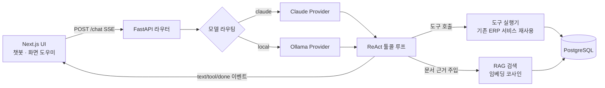

# 제조 ERP + AI 업무 보조 (포트폴리오)

> **한 줄 요약** — 사내 ERP에 **툴콜링 에이전트 + RAG 지식 챗봇 + 화면 컨텍스트 도우미**를 붙이고,
> "LLM이 지어내지 않게(할루시네이션 제어)"와 "실시간 수치는 도구, 정적 지식은 문서로" 라우팅을
> **실패를 측정해가며** 설계한 풀스택 AI 프로젝트.

- **역할**: 기획·설계·백엔드·프론트·AI 전부 (1인)
- **핵심 성과**: RAG 챗봇의 할루시네이션/검색 충돌을 **데이터·프롬프트·검색 임계값 3중 설계**로 해결
- **데모 포인트**: 같은 질문이라도 "재고 얼마?"는 **라이브 도구**로, "임차료 계정 코드?"는 **문서 근거**로 답이 갈림

---

## 기술 스택

| 영역 | 사용 |
|---|---|
| Backend | FastAPI, SQLModel, PostgreSQL |
| Frontend | Next.js 14 (App Router), TypeScript, TailwindCSS (자체 디자인 시스템) |
| LLM | Claude (Anthropic API) · 로컬 Ollama `qwen2.5:7b` (모델 라우팅) |
| RAG | 임베딩 `bge-m3`(dim 1024) · Postgres JSONB 벡터 저장 · numpy 코사인 검색(pgvector 미사용) |
| 스트리밍 | Server-Sent Events(SSE) — 토큰·도구호출 이벤트 실시간 전송 |

---

## 아키텍처



**설계 원칙**
1. LLM 호출·도구 실행·키 관리는 **전부 백엔드** (프론트 노출 없음).
2. 도구 스키마는 **provider 중립으로 한 번만 정의**, Claude/Ollama 포맷은 어댑터가 변환.
3. **실시간 수치 = 도구, 정적 지식 = RAG 문서** — 경계를 데이터·프롬프트 양쪽에서 강제.

---

## AI 핵심 기능

### 1. RAG 할루시네이션 제어 · 도구 vs 문서 라우팅 ⭐
- **문제**: (a) 문서에 없는 내용을 모델이 자기 지식으로 지어냄, (b) 반대로 검색 임계값이 높아 문서에 **있는** 내용도 "못 찾음", (c) 데이터 스냅샷을 문서에 넣으면 "재고 얼마?"에 **옛 스냅샷 값**으로 답하는 충돌.
- **접근**:
  - 질문마다 문서를 미리 검색해 시스템 프롬프트에 **근거 블록 자동 주입**(`context_for`) — 작은 로컬 모델이 도구 호출을 스스로 못 하는 문제 보완.
  - **엄격 근거 가드**(`_guard_answer`): 문서·도구 근거가 하나도 없으면 자체지식 답변을 막고 "문서에서 찾을 수 없습니다"로 대체.
  - **실시간 수치는 스냅샷에서 제외**(재고 수량·주문 합계) → 문서에 값이 없으니 재고 질문은 자연히 도구로 감.
  - **경로별 검색 임계값 분리**: 메인 챗봇 0.45(정확), 화면 도우미 0.35(SOP를 더 잘 찾게).
- **트레이드오프(실측)**: 임계값 0.45로 낮췄더니 재고 질문이 스냅샷 옛 값("28박스")으로 답하는 걸 **직접 측정** → 원인을 임계값이 아니라 **데이터 설계**에서 제거(스냅샷에서 재고 숫자 삭제).
- **결과**: "탄산수 재고?" → `get_inventory` 도구(라이브), "임차료 계정 코드?" → 문서(819) 로 정확히 분리 확인.

### 2. Provider 중립 툴콜링 에이전트
- 도구 `get_dashboard·get_inventory·list_orders·list_partners·search_documents`를 **한 벌 스키마**로 정의하고 Claude `tools` / Ollama `function` 포맷으로 어댑터 변환.
- **ReAct 루프**(최대 N라운드): 모델이 도구 호출 → 백엔드가 기존 ERP 로직 실행 → 결과 재주입 → 최종 답변.
- 도구가 기존 REST 서비스 함수를 재사용 → **재고 반영·검증 로직이 챗봇에서도 동일하게 동작**.

### 3. 로컬 RAG 파이프라인 (업로드→색인→검색)
- 파일(PDF/MD/txt)·붙여넣기 업로드 → 텍스트 추출 → 청킹 → `bge-m3` 임베딩 → Postgres JSONB 저장.
- **비동기 인제스트**(FastAPI BackgroundTask) + 프론트 상태 폴링(`indexing → ready/error`).
- 검색 로직(`retrieval.search`) 한 곳을 **검색 API와 챗봇 도구(`search_documents`)가 공유**.
- pgvector 없이 numpy 브루트포스 코사인 — 프로토타입 규모에서 이식성 우선한 의도적 선택.

### 4. 화면 컨텍스트 도우미 에이전트
- 모든 화면 우하단 "? 도움말" → 드로어가 **현재 화면을 인식**해 추천 질문 + 근거 답변 + 출처 표시.
- 지식 문서에 **화면별 UI 사용법(SOP)** 을 넣어, "품목 어떻게 등록?" → "① 영업관리>품목관리 ② +품목 등록 ③ …(출처: 사내 지식문서)" 식 실행형 답변.
- 실사용성 초점: 빈 입력창 대신 **클릭 가능한 추천 질문**으로 진입장벽 제거.

### 5. 모델 라우팅 (Claude API ↔ 로컬 Ollama)
- 공통 인터페이스(`run_chat`)로 모델 교체 — 단순 조회는 로컬(무료), 복잡한 추론은 Claude.
- `temperature=0` + 근거 프롬프트로 결정성·재현성 확보.

---

## 엔지니어링 하이라이트 (측정 기반 의사결정)

> "RAG 만들었어요"가 아니라 **"이렇게 실패했고, 측정해서, 이렇게 고쳤다"**.

- **할루시네이션 → 코드 가드**: 프롬프트만으로 안 막혀서, 근거 0이면 코드에서 답변을 정형 문구로 강제(`RAG_STRICT`).
- **검색이 있는 내용을 못 꺼냄 → 경로별 임계값**: 도움말과 메인 챗봇의 요구가 달라 임계값을 분리.
- **데이터-도구 충돌 → 데이터 레벨에서 제거**: 재고 숫자를 문서에서 빼 프롬프트 규칙과 데이터가 같은 방향을 가리키게 함.
- **정합성**: 지식 문서를 DB에서 자동 생성(스냅샷)해, 데이터가 늘어도 재색인으로 최신 반영.

---

## 한계 & 다음 단계 (정직하게)

- **집계 정확도**: 큰 표(직원 15행)가 검색 청크로 쪼개져 "몇 명?" 카운트가 부정확할 수 있음(로컬 모델 + 청킹 한계) → 하이브리드 검색/rerank/전용 집계 도구로 개선 예정.
- **평가 부재**: 정답률·할루시네이션율을 자동 측정하는 eval 하네스 미구축 → 골든셋 기반 eval이 다음 우선순위.
- **쿠키 기반 Claude 호출**은 실험만 하고 **프로덕션·포폴에서 제외**(Anthropic ToS 회색지대·불안정).
- 접근 제어는 현재 **UI 레벨**(로그인 없는 프로토타입) → API 신원검사는 후속.

---

## 실행 방법 (요약)

```bash
# DB: PostgreSQL(erp), Ollama(qwen2.5:7b, bge-m3 pull)
# 백엔드
cd backend && uvicorn app.main:app --host 127.0.0.1 --port 8000
# 프론트
cd frontend && npm run dev   # http://localhost:3000
# 지식문서 PDF 재생성(백엔드 실행 중)
.venv/bin/python docs/build_knowledge_pdf.py
```

주요 코드: `backend/app/chat/`(providers·tools·router), `backend/app/rag/`(retrieval·embeddings·chunk·ingest), `frontend/app/components/`(HelpDrawer·CrudManager), `docs/build_knowledge_pdf.py`.
