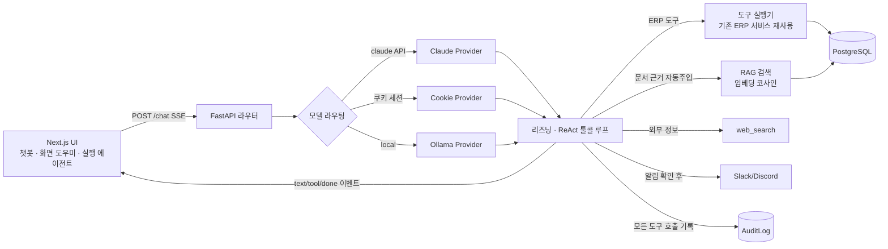

# 제조·유통 ERP + RAG 에이전트 ‘원장(元帳)’ (포트폴리오)

> **한 줄 요약** — 사내 ERP에 **정체성·리즈닝을 가진 RAG 에이전트 + 화면 컨텍스트 도우미 + 사람 승인형 실행 에이전트**를
> 붙이고, “LLM이 지어내지 않게(할루시네이션 제어)”와 “실시간 수치는 도구·정적 지식은 문서·외부 정보는 웹”이라는
> 근거 라우팅을 **실패를 측정해가며** 설계한 풀스택 AI 프로젝트.

- **역할**: 기획·설계·백엔드·프론트·AI 전부 (1인)
- **핵심 성과**: RAG 챗봇의 할루시네이션과 **근거 오염(웹검색 답변에 무관한 사내 문서가 딸려오는 문제)** 을
  임베딩 유사도 분포를 직접 측정해 **잡음/신호 사이 임계값(0.50)** 으로 근본 해결
- **차별점**: 단순 “문서 찾아 붙이는 RAG AI”를 넘어, **의도 분류 → 근거 계획 → 도구 실행 → 자기 점검 → 답변**의
  5단계 리즈닝을 가진 에이전트(‘원장’)로 설계
- **데모 포인트**: 같은 인터페이스에서 “탄산수 재고?”는 **라이브 도구**, “안전재고 정의?”는 **사내 문서**,
  “비트코인 시세?”는 **웹 검색** 으로 스스로 근거 경로가 갈림 — 화면에 **출처 배지(🌐/📄/📊)** 로 명시

---

## 기술 스택

| 영역 | 사용 |
|---|---|
| Backend | FastAPI, SQLModel, PostgreSQL |
| Frontend | Next.js 14 (App Router), TypeScript, TailwindCSS (‘물류 원장’ 자체 디자인 시스템) |
| LLM | Claude(공식 API) · claude.ai 구독 세션(개발 중 비용 회피) · 로컬 Ollama `qwen2.5:7b` — **3-provider 라우팅** |
| RAG | 임베딩 `bge-m3`(dim 1024) · Postgres JSONB 벡터 저장 · numpy 코사인 검색(pgvector 미사용, 이식성 우선) |
| 도구/연동 | ERP 조회 도구 5종 · `web_search`(DuckDuckGo) · Slack/Discord 웹훅 알림 |
| 안전장치 | 근거 가드(RAG_STRICT) · 사람 승인형 실행(plan→apply) · 감사 로그(AuditLog) · 출처 추적 |
| 스트리밍 | Server-Sent Events(SSE) — 텍스트·도구호출 이벤트 실시간 전송 |

---

## 아키텍처



**설계 원칙**
1. LLM 호출·도구 실행·키 관리는 **전부 백엔드** (프론트 노출 없음).
2. 도구 스키마는 **provider 중립으로 한 번만 정의**, Claude/Ollama 포맷은 어댑터가 변환.
3. **실시간 수치 = 도구 / 정적 지식 = 문서 / 외부 정보 = 웹** — 경계를 데이터·프롬프트·검색 임계값에서 강제.
4. **부작용(전송·쓰기)은 반드시 사람 확인 후**, 모든 도구 호출은 감사 로그에 남긴다.

---

## AI 핵심 기능

### 1. RAG 에이전트 ‘원장(元帳)’ — 리즈닝을 가진 에이전트로 승격 ⭐
- **기존(RAG AI)**: 이름·역할 없는 수동 도우미. 질문 오면 문서를 찾아 근거만 붙여 답 → 판단 부재.
- **개선(RAG 에이전트)**: 시스템 프롬프트에 **정체성 + 5단계 리즈닝 + 규칙**을 심어 능동적으로 동작.
  1. **의도 분류** — 실시간 수치 / 사내 규정 / 외부 정보 / 단순 대화 중 무엇인가
  2. **근거 계획** — 그 답을 뒷받침할 근거를 어떤 도구로 얻을지 결정
  3. **실행** — 도구 호출로 근거 확보(필요 시 여러 개 연쇄)
  4. **자기 점검** — 근거가 충분한지 스스로 검토, 부족하면 도구 재호출
  5. **답변** — 확보한 근거로만 답, 없으면 지어내지 않고 “찾을 수 없습니다”
- **엔지니어링 포인트**: 공식 API 경로와 쿠키 경로가 **같은 에이전트**로 동작하도록 정체성·리즈닝·규칙을
  **공유 상수**로 분리(`AGENT_IDENTITY`/`REASONING_FRAMEWORK`/`AGENT_RULES`) → 프롬프트 드리프트 제거.

### 2. 근거 오염(할루시네이션 오인) 버그 — 임베딩 분포 측정으로 근본 해결 ⭐
- **증상**: “비트코인 시세” 같은 웹검색 질문에도 답변에 가짜 “(출처: 사내 문서)”가 붙고, 도우미의 ‘참고 문서’에
  무관한 사내 문서가 표시됨(할루시네이션처럼 보임).
- **원인 규명(측정)**: 자동 문서주입 임계값이 `0.45`였는데, 질문별 실제 유사도를 재보니 —
  단일 대형 지식문서 특성상 **무관한 질문도 한국어·도메인 어휘가 겹쳐 ~0.44의 ‘잡음 유사도’** 를 냈고
  (비트코인 0.475), **진짜 관련 질문은 0.52~0.66** 에 몰려 있었다. 0.45는 잡음 구간 안이라 사실상 다 통과.
- **해결**:
  - 임계값을 **잡음/신호 사이 골인 0.50** 으로 상향(`CONTEXT_MIN_SCORE`).
  - 도우미가 쓰던 과도한 override(0.35) 제거 → **백엔드 단일 기준으로 통일**.
  - ‘참고 문서’는 답변이 **실제로** 문서 도구(`doc_context`/`search_documents`)를 호출했을 때만 노출하도록,
    별도 검색이 아니라 **답변의 실제 근거(스트림 이벤트)** 에 연동.
  - **출처 배지**(🌐 웹 검색 / 📄 사내 문서 / 📊 ERP 데이터 / 🧠 근거 없음)로 근거를 화면에 명시.
- **검증**: 비트코인→`web_search`, 안전재고→`doc_context`, 재고→`get_inventory` 로 스스로 라우팅 확인.

### 3. Provider 중립 툴콜링 + 외부 검색 폴백
- ERP 도구 `get_dashboard·get_inventory·list_orders·list_partners·search_documents`를 **한 벌 스키마**로 정의,
  Claude `tools` / Ollama `function` 포맷으로 어댑터 변환.
- **ReAct 루프**(최대 6라운드): 모델이 도구 호출 → 백엔드가 기존 ERP 로직 실행 → 결과 재주입 → 최종 답변.
- **web_search 백엔드 폴백**: 작은 로컬 모델이 도구를 스스로 못 부르는 한계를 보완 —
  근거 없이 거부하기 직전 **서버가 직접 웹 검색을 실행**해 그 결과를 근거로 주입, 한 번 더 답하게 함.

### 4. 사람 승인형 실행 에이전트 (plan → 확인 → apply)
- “콜라 1.5L 코드 D-200 판매가 2000으로 등록해줘” 같은 자연어를 받아 **변경 계획을 먼저 제안**,
  사용자가 확인해야 실제 등록/수정 실행 → **부작용은 human-in-the-loop** 로 통제.
- Slack/Discord 알림도 동일: 미리보기 → `확인` → 전송, 전송 이력은 감사 로그에 기록.

### 5. 화면 컨텍스트 도우미 에이전트
- 모든 화면 우하단 “? 도움말” 드로어가 **현재 화면을 인식**해 추천 질문 + 근거 답변 + 출처 표시.
- 지식 문서에 **화면별 UI 사용법(SOP)** 을 넣어 “품목 어떻게 등록?” → 단계별 실행형 답변(+출처).
- 빈 입력창 대신 **클릭 가능한 추천 질문**으로 진입장벽 제거.

### 6. 역할 기반 접근 제어(RBAC) + 로그인 + 감사 로그
- DB 기반 역할/모듈 권한, 직원 선택형 로그인, UI 레벨 접근 차단.
- 모든 도구 호출·전송을 `AuditLog`(누가·무엇을·언제·성공여부)에 기록 → 운영·보안 추적 기반.

---

## 엔지니어링 하이라이트 (측정 기반 의사결정)

> “RAG 만들었어요”가 아니라 **“이렇게 실패했고, 측정해서, 이렇게 고쳤다”**.

- **근거 오염 → 임베딩 분포 측정**: 임계값을 감이 아니라 **질문별 실제 코사인 점수 분포**(잡음 0.44 / 신호 0.52+)를
  측정해 그 사이 골(0.50)로 설정. 정답셋 부재가 버그의 근본 원인이었음을 회고로 도출.
- **할루시네이션 → 코드 가드**: 프롬프트만으로 안 막혀서, 근거 0이면 코드에서 답변을 정형 문구로 강제(`RAG_STRICT`).
- **provenance 정합성**: “화면이 보여주는 근거”와 “답변이 실제로 쓴 근거”를 **분리하지 않도록** 스트림 이벤트에 연동.
- **프롬프트 드리프트 제거**: 3개 provider가 어긋나지 않게 에이전트 정체성을 **공유 상수화**.
- **작은 모델 한계 보완**: 로컬 모델의 도구호출 실패를 **서버측 폴백 검색**으로 커버.

---

## 한계 & 다음 단계 (정직하게)

- **평가 부재**: 정답률·할루시네이션율·근거 정확도를 자동 측정하는 **eval 하네스 미구축** → “질문→기대출처” 골든셋이
  다음 최우선(이번 근거 오염 버그가 조용히 난 근본 원인).
- **단일 대형 지식문서**가 잡음 유사도(0.44)의 원천 → **주제별 문서 분리**로 검색 품질 개선 여지.
- **집계 정확도**: 큰 표가 청크로 쪼개져 “몇 명?” 카운트가 부정확할 수 있음 → rerank/전용 집계 도구로 개선 예정.
- **쿠키 기반 Claude 호출**은 개발 중 비용 회피용 실험 — Anthropic ToS 회색지대·불안정성 때문에 프로덕션은
  공식 API 폴백을 기본으로 함(정직하게 명시).
- 접근 제어는 현재 **UI 레벨** → API 신원검사(서버측 인가)는 후속.

---

## 실행 방법 (요약)

```bash
# DB: PostgreSQL(erp), Ollama(qwen2.5:7b, bge-m3 pull)
# 백엔드
cd backend && uvicorn app.main:app --host 127.0.0.1 --port 8000
# 프론트
cd frontend && npm run dev   # http://localhost:3000
# 지식문서 PDF 재생성(백엔드 실행 중)
.venv/bin/python docs/build_knowledge_pdf.py
```

**주요 코드**
- `backend/app/chat/` — `providers.py`(모델 라우팅·리즈닝 프롬프트·web 폴백), `claude_cookie.py`(쿠키 ReAct),
  `tools.py`(도구 정의·감사 기록), `router.py`
- `backend/app/rag/` — `retrieval.py`(임계값·근거 주입), `embeddings.py`, `chunk.py`, `ingest.py`
- `backend/app/integrations/` — `slack.py`(웹훅·자동판별), `router.py`(전송·감사 조회)
- `backend/app/audit.py` — 감사 로그 기록/조회
- `frontend/app/components/` — `HelpDrawer.tsx`(화면 도우미·출처 배지), `CrudManager.tsx`
- `frontend/app/chat/page.tsx` — 챗봇·출처 배지·슬랙 전송
